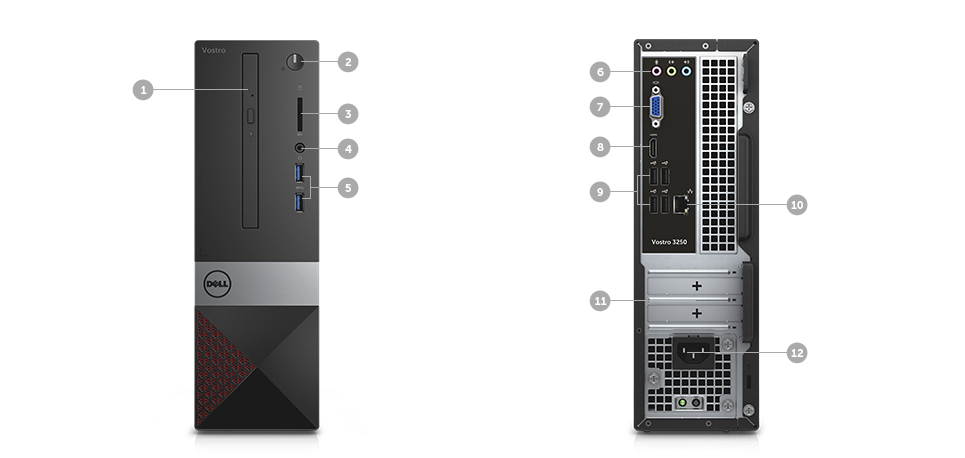
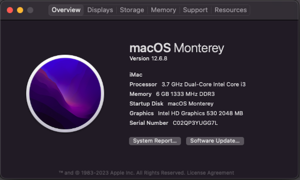
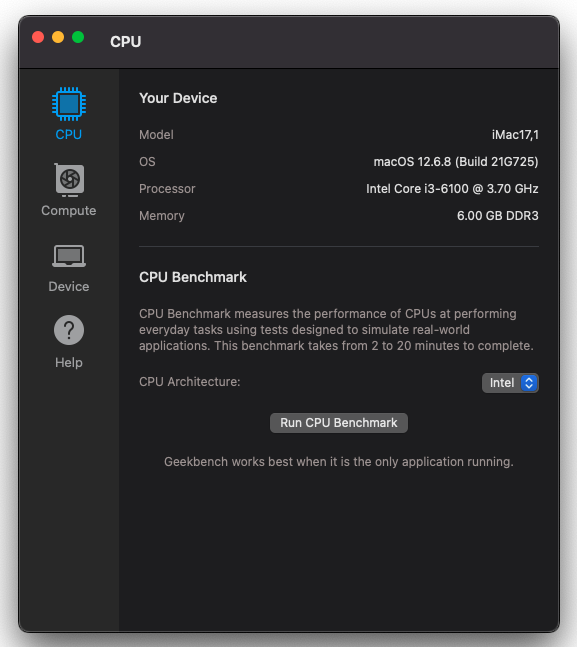
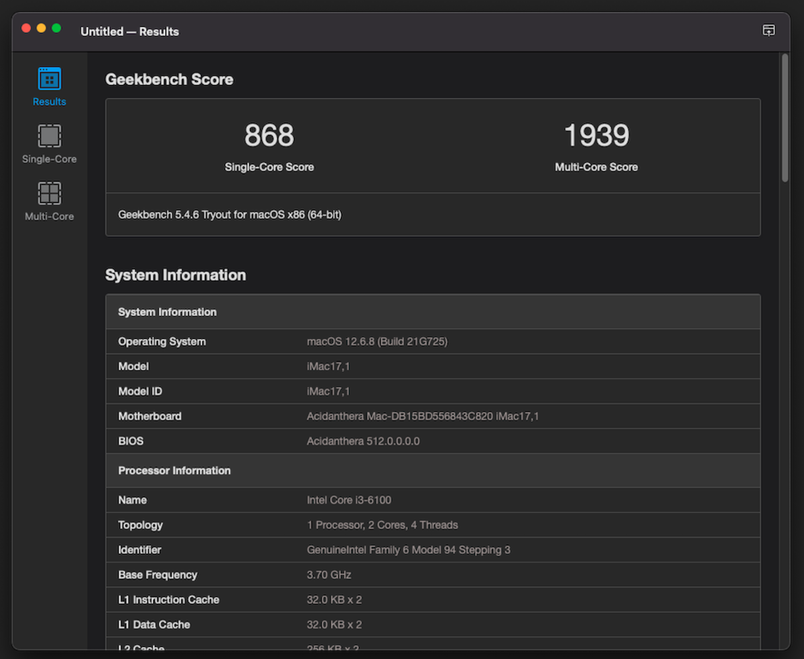

## Dell Vostro 3250 Hackintosh OpenCore EFI





### [简体中文](README.zh_CN.md)


### OpenCore

[OpenCore 0.9.6](https://github.com/acidanthera/OpenCorePkg)


### macOS

- Monterey


### Spec

- Chipset: H110
- CPU: Intel i3-6100
- Memo: SK hynix 6GB(4+2) DDR3 1600 Mhz
- iGPU: Intel UHD Graphic 530
- HDA: Realtek ALC662
- SSD: GLOWAY 128G SATA3
- LAN: RTL8168/8111


### BIOS

```
Boot
    |---- Security Boot: disabled
```


### What Works

- LAN
- HDMI/HDMI Audio 
- Front and rear audio jack


#### issues

- Dell WLAN not work.
- BT not work.
- VGA not test.


### Notes
 - Use [OpenCore Configurator](https://mackie100projects.altervista.org/opencore-configurator/) build your SMBIOS
 - U Must Use CFGLock.efi Tool Unlock CFG LOCK first


### Screenshot









### Kexts

- [Lilu.kext 1.6.7](https://github.com/acidanthera/Lilu)
- [SMCProcessor.kext 1.3.2](https://github.com/acidanthera/VirtualSMC)
- [SMCSuperIO.kext 1.3.2](https://github.com/acidanthera/VirtualSMC)
- [VirtualSMC.kext 1.3.2](https://github.com/acidanthera/VirtualSMC)
- [WhateverGreen.kext 1.6.6](https://github.com/acidanthera/WhateverGreen)
- [AppleALC.kext 1.8.7](https://github.com/acidanthera/AppleALC)
- [RealtekRTL8111.kext 2.4.2](https://github.com/Mieze/RTL8111_driver_for_OS_X)


### Tools

- [Hackintool](https://github.com/headkaze/Hackintool) 
- [OCAuxiliaryTools](https://github.com/ic005k/OCAuxiliaryTools) AKA `OCAT`.
- [OpenCore Configurator](https://mackie100projects.altervista.org/opencore-configurator/) AKA `OCC`.
- [GenSMBIOS](https://github.com/corpnewt/GenSMBIOS) Generate SMBIOS.
- [MountEFI](https://github.com/corpnewt/MountEFI) Mount EFI partition.
- [EFI Agent](https://github.com/headkaze/EFI-Agent) Better EFI partition mount App.
- [gibMacOS](https://github.com/corpnewt/gibMacOS) Build your own MacOS image.
- [ProperTree](https://github.com/corpnewt/ProperTree) Plist editor.


### Contact Us

 - [Hackintosh.Club](https://hackintosh.club/) 
 - QQ Group: 23304408 
 
