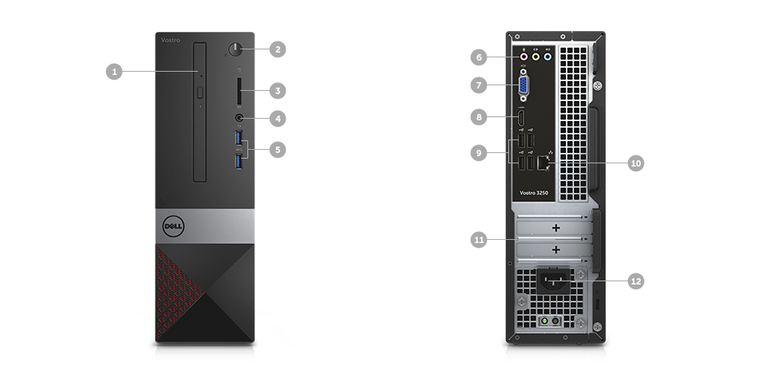
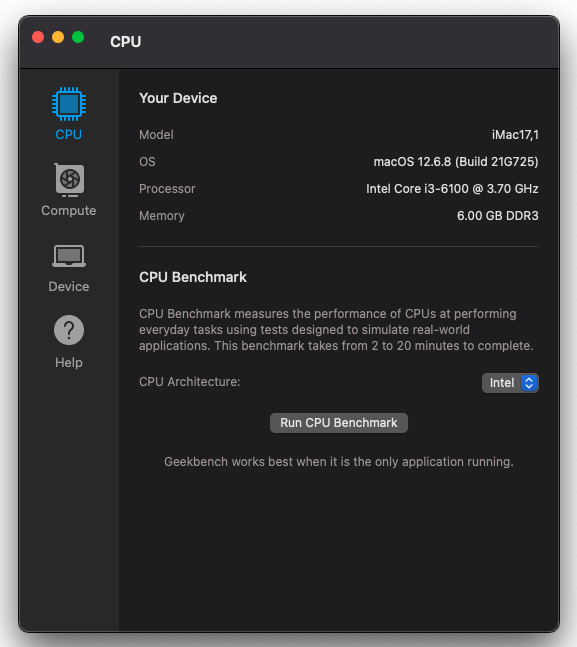
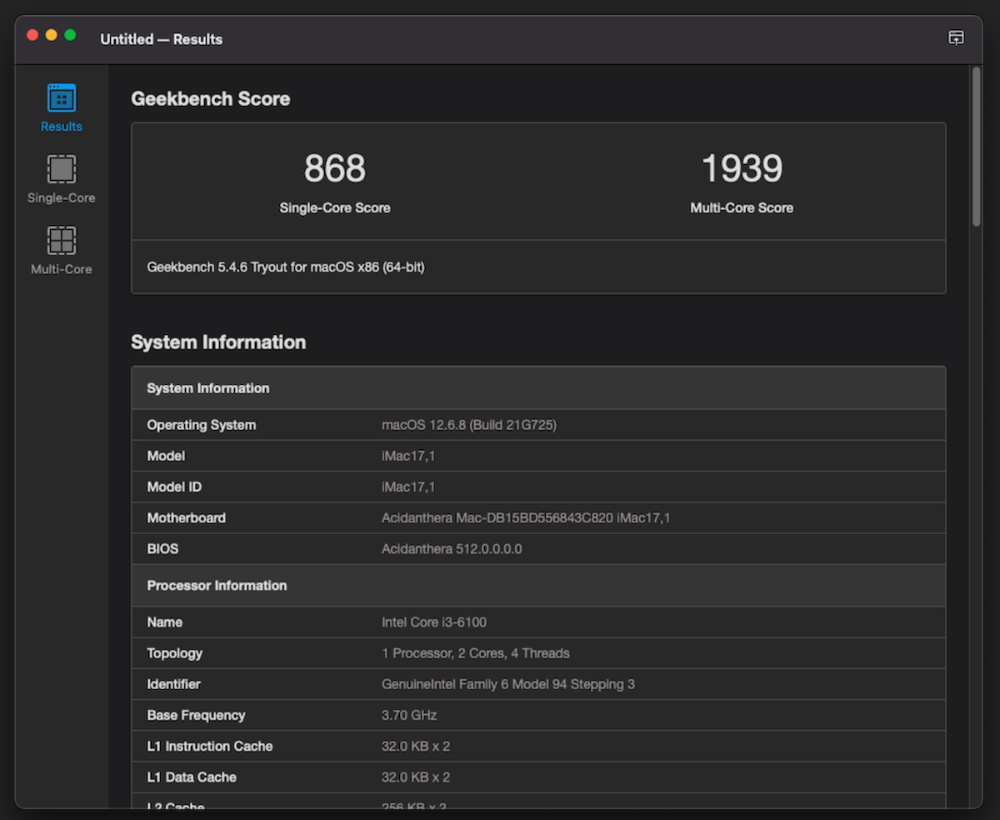

## 戴尔成就 Dell Vostro 3250 黑苹果 OpenCore EFI





### [English](README.md)


### OpenCore

[OpenCore 0.9.7](https://github.com/acidanthera/OpenCorePkg)


### macOS

- Monterey


### 机器配置

- 主板: H110
- 处理器: Intel i3-6100
- 内存: 海力士 6GB(4+2) DDR3 1600 Mhz
- 显卡: 英特尔® 超核芯显卡 530
- 声卡: Realtek ALC662
- 硬盘: 光威 128G SATA3
- 网卡: RTL8168/8111


### BIOS设置

```
Boot
    |---- Security Boot: disabled
```


### 适配情况

#### 正常运行

- 有线网络正常
- HDMI、HDMI音频正常
- 前置麦克风可用、耳机可用，后置耳机、麦克风可用


#### 存在问题

- 无线网卡需要更换为拆机白果卡，或Intel网卡使用，原装dell网卡无法驱动
- 蓝牙同上
- VGA接口未测试


### 注意事项
 - 使用 [OpenCore Configurator](https://mackie100projects.altervista.org/opencore-configurator/) 生成 SMBIOS
 - 安装前务必使用CFGLock.efi工具解锁 CFG LOCK


### 系统截图







### 驱动

- [Lilu.kext 1.6.7](https://github.com/acidanthera/Lilu)
- [SMCProcessor.kext 1.3.2](https://github.com/acidanthera/VirtualSMC)
- [SMCSuperIO.kext 1.3.2](https://github.com/acidanthera/VirtualSMC)
- [VirtualSMC.kext 1.3.2](https://github.com/acidanthera/VirtualSMC)
- [WhateverGreen.kext 1.6.6](https://github.com/acidanthera/WhateverGreen)
- [AppleALC.kext 1.8.8](https://github.com/acidanthera/AppleALC)
- [RealtekRTL8111.kext 2.4.2](https://github.com/Mieze/RTL8111_driver_for_OS_X)


### 工具

- [Hackintool](https://github.com/headkaze/Hackintool) 
- [OCAuxiliaryTools](https://github.com/ic005k/OCAuxiliaryTools) 即 `OCAT`.
- [OpenCore Configurator](https://mackie100projects.altervista.org/opencore-configurator/) 即 `OCC`。
- [GenSMBIOS](https://github.com/corpnewt/GenSMBIOS) 三码生成工具。
- [MountEFI](https://github.com/corpnewt/MountEFI) EFI 分区挂载工具。
- [EFI Agent](https://github.com/headkaze/EFI-Agent) 更方便的EFI分区挂载工具。
- [gibMacOS](https://github.com/corpnewt/gibMacOS) macOS 官方镜像下载工具。
- [ProperTree](https://github.com/corpnewt/ProperTree) Plist 编辑器。


### 联系我们

 - [Hackintosh.Club - 黑果之家](https://hackintosh.club/) 
 - QQ群: 23304408 
 

